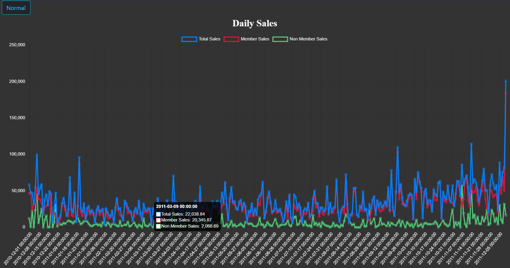
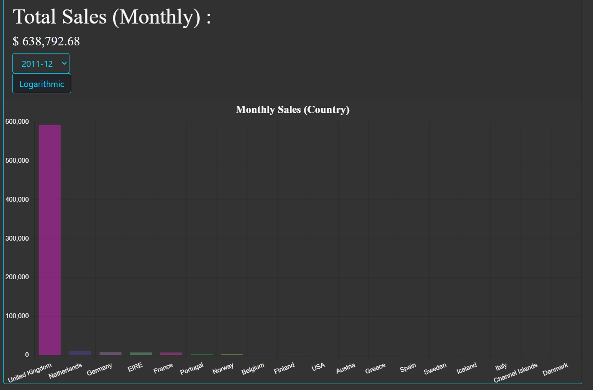
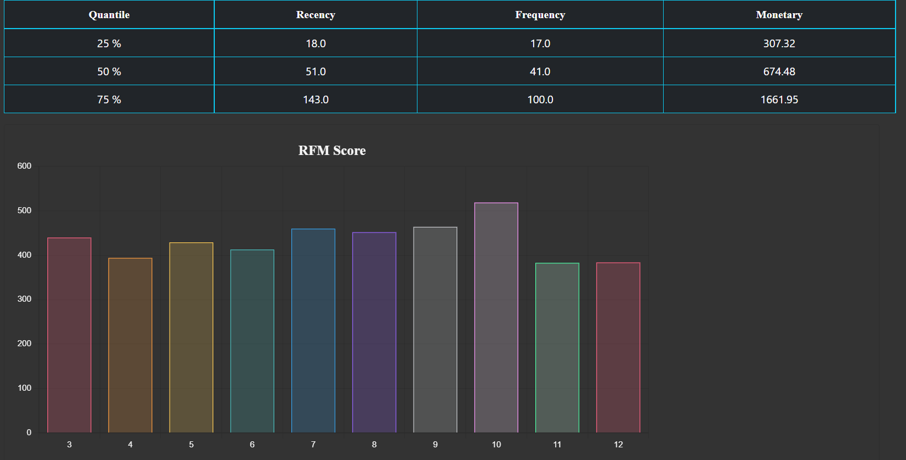
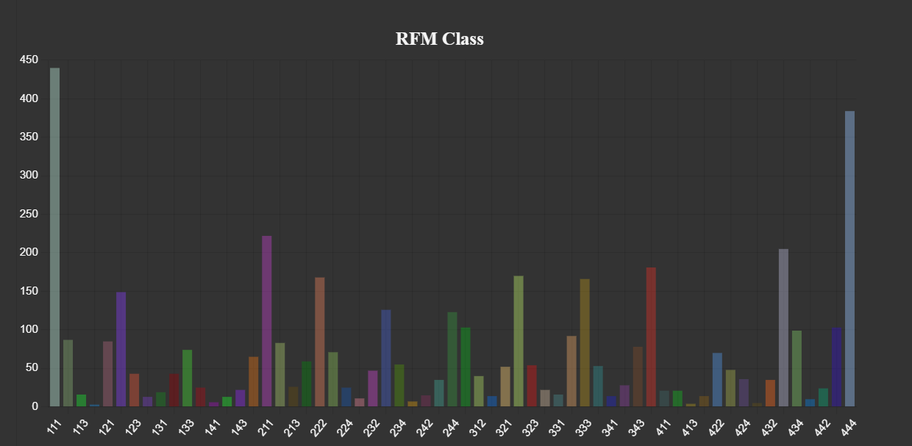

<h1>Retail Dashboard</h1>

The data was taken from kaggle public data :

<a href="https://www.kaggle.com/datasets/rupakroy/online-retail" target="_blank">Online Retail</a>

<h2>Assumptions to be made :</h2>

A number of assumptions have been made while making this dashboard

<ol>
<li>If the Customer ID column has no value the customer will be assumed as non-member (vice-versa to invoice that has Customer ID)</li>
<li>Negative value on `Quantity` and `UnitPrice` columns will be dropped. (about 10,000 rows)
</ol>

<h2>List of features :</h2>
<ul>
<li><strong>Home</strong> : Basic summary of the data (e.g. {total sales, most and least purchasing based on country, etc.})</li>
<li><strong>Sales</strong> : Displaying monthly sales based on member and non-member</li>
<li><strong>RFM</strong> : Segmenting/cluster the customer based on it's behavior</li>
<li><strong>Country</strong> : Displaying the customer based on it's country</li>
<li><strong>Combo</strong> : Displaying the most bought product pairs based on Invoice/Customer.</li>
</ul>
<h2>Preview Page :</h2>
<h3>Sales Page</h3>

<h3>Country Sales</h3>

<h3>Customer Segmentation Page</h3>

